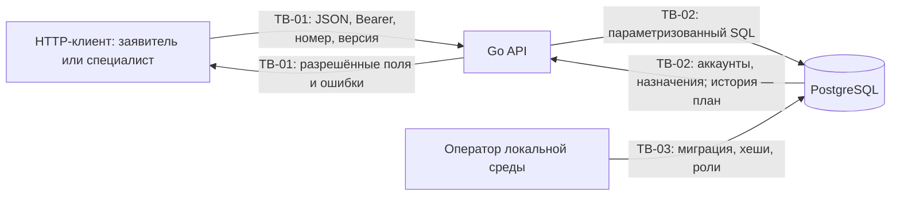

# Модель угроз

## Модель продукта

Назначение, пользователи и целевые сценарии: [PROJECT.md](PROJECT.md). Клиент отправляет JSON и Bearer-токен API на Go. API проверяет сессию и полномочия, выполняет параметризованный SQL в PostgreSQL и формирует отдельный ответ для клиента. Подготовка аккаунтов выполняется локальным `cmd/seed`, а не через HTTP.

В ответном потоке API получает данные БД и формирует разрешённый DTO. Хеши паролей, записи сессий и будущие внутренние заметки не передаются клиенту в общей карточке; историю и заметки нужно проверять после их реализации.

**Уже существует к EK1:** health/ready, вход/выход, сессии, создание и чтение собственных либо назначенных обращений. Точный перечень: [API.md](API.md). Назначенные записи используются как тестовые данные; команды назначения ещё нет.

**Планируется:** минимальная очередь, принятие, сообщения, внутренние заметки, закрытие и повторное открытие с историей. Решения для них не считаем выполненными проверками.

**Допущения:** локальная учебная демонстрация на loopback; оператор и прямой доступ к БД доверенные. Нет регистрации, администратора, смены ответственного и внешних интеграций. Для сетевого развёртывания понадобятся TLS и дополнительные ограничения попыток входа. Компрометация ОС, учётной записи оператора или самого клиента выходит за принятую границу.

## Границы доверия

| Граница | Данные | Почему проверяем |
| --- | --- | --- |
| TB-01: клиент → API | Пароль, токен, JSON, номер и версия обращения | Пользователь управляет всем запросом. Логин ещё не даёт права на чужой объект; роль в JSON недостоверна. |
| TB-02: API → PostgreSQL | Параметры SQL, хеш сессии, состояние и назначение | Текст остаётся недоверенным; конкурирующие запросы разделяют одно состояние. API отвечает за политику, БД — за ограничения и атомарность. |
| TB-03: оператор → подготовка БД | Имена, роли, пароль учебных аккаунтов | Команда подготовки обладает прямыми правами. Она не доступна клиенту, пароль передаётся через окружение, локальные секреты исключены из Git. |

## Значимые объекты

Описание и переписка, внутренние заметки, назначения, решения и история, пароли и сессии: [паспорт, раздел 5](PROJECT.md#5-значимые-данные-и-другие-объекты). Утечка текста нарушает приватность; подмена ответственного открывает содержание; потеря истории и неверное закрытие мешают обработке.

## Угрозы и приоритеты

Приоритет оценивается для целевого продукта по последствиям, реалистичности запроса или сбоя и дополнительным предпосылкам. Высокий: обычный запрос, конкурентное действие или сбой может раскрыть личные данные, изменить полномочия либо нарушить обработку и сохранение истории. Средний: существенный ущерб требует дополнительного доступа вне обычного HTTP-сценария. Наличие функции в первой версии не меняет риск целевого продукта; статус реализации указан отдельно.

В приоритетный набор включены T-01–T-07 и T-09. T-03 защищает приватность внутренних заметок, T-05 — допустимые переходы и целостность истории. Для T-08 нужен доступ к копии БД; парольная защита D-01 остаётся обязательной и при среднем приоритете. Все угрозы связаны с решениями; будущие механизмы и проверки не объявляются реализованными.

| ID | Конкретный сценарий и последствие | Граница / точка входа | SR | Приоритет и причина | Решение |
| --- | --- | --- | --- | --- | --- |
| T-01 | Посетитель отправляет запрос без сессии или с истёкшим/отозванным токеном; сервер доверяет наличию заголовка и открывает обращения. | TB-01, любой защищённый маршрут | SR-01 | Высокий, **выбран**: вход защищает все личные данные; подмена заголовка доступна любому. | D-01 |
| T-02 | Заявитель B подставляет ID обращения A при чтении карточки или получает его содержание в общем списке; S2 запрашивает назначенное S1 либо свободное обращение, получая тему и описание. | TB-01, чтение и очередь | SR-02 | Высокий, **выбран**: знание номера легко получить; потеря приватности основная. | D-02 |
| T-03 | Автор запрашивает карточку после закрытия, а универсальный DTO включает внутреннюю заметку S1; S2 получает её отдельным запросом. | TB-01, будущие заметки и общий ответ | SR-03 | Высокий, **выбран**: обычное чтение карточки либо заметки может раскрыть служебное содержание; дополнительный доступ к БД не нужен. | D-02 |
| T-04 | Заявитель передаёт `author_id` другого пользователя, роль специалиста, состояние `closed` или ответственного. Сервер массово присваивает поля и создаёт ложное авторство / права. | TB-01, создание и будущие команды | SR-04 | Высокий, **выбран**: достаточно собственного аккаунта; повреждает модель доступа. | D-02 |
| T-05 | Специалист закрывает новое обращение или пустым решением; сбой между сменой состояния и записью решения оставляет закрытое обращение без истории. Повторное открытие перезаписывает прежнее решение. | TB-01/TB-02, будущие переходы | SR-05 | Высокий, **выбран**: неверный переход или обычный сбой записи скрывает нерешённую проблему либо теряет историю основного сценария. | D-03 |
| T-06 | S1 и S2 одновременно читают свободное состояние, затем по отдельности присваивают себя. Оба получают успех, назначение последнего затирает первое и открывает ему содержание. | TB-02, будущее принятие | SR-06, SR-02 | Высокий, **выбран**: обычное совпадение запросов, не требует злого умысла; меняет доступ и ответственность. | D-03 |
| T-07 | Пользователь вводит кавычки/комментарий в логин, ID или описание, а сервер склеивает SQL. Он обходит вход, читает чужие записи или повреждает данные. | TB-01 → TB-02, SQL | SR-07 | Высокий, **выбран**: любой текстовый ввод; последствия распространяются за пределы одного обращения. | D-04 |
| T-08 | Получивший копию БД перебирает быстрые несолёные хеши или извлекает открытые пароли, затем входит как автор чужих обращений. | TB-03, утёкшая копия accounts | SR-08, SR-01 | Средний: нужна копия БД; парольная защита всё равно обязательна, а одинаковые учебные пароли усиливают ущерб. | D-01 |
| T-09 | Задержавшаяся команда S1 закрыть первый цикл приходит после закрытия и повторного открытия того же обращения. Роль, ответственный и `in_progress` снова совпадают; старое решение закрывает новый разбор. | TB-01/TB-02, будущая команда закрытия | SR-05 | Высокий, **добавлен в приоритетный набор**: обычная задержка/повтор запроса; нерешённая проблема скрывается даже при правильной блокировке. | D-03 |

Все D находятся в [DESIGN_DECISIONS.md](DESIGN_DECISIONS.md). Выполненные проверки относятся только к существующей части API; приёмка будущих команд остаётся в D.

